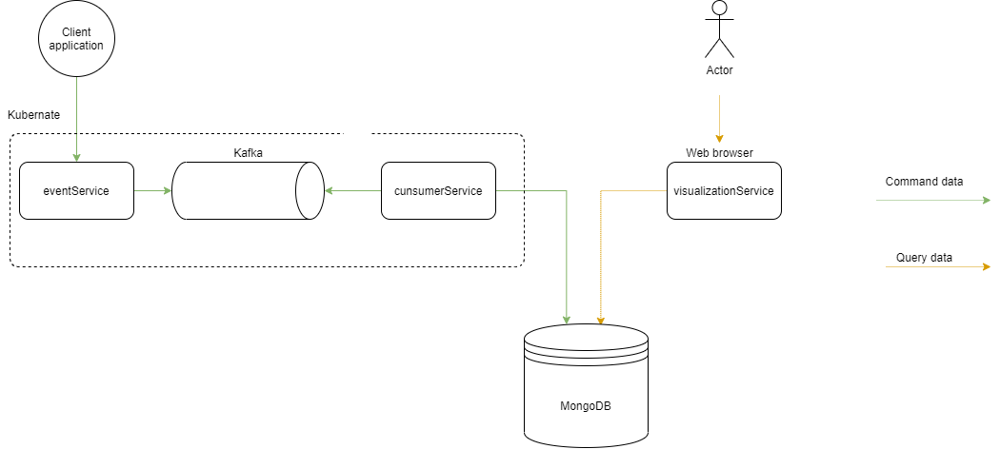
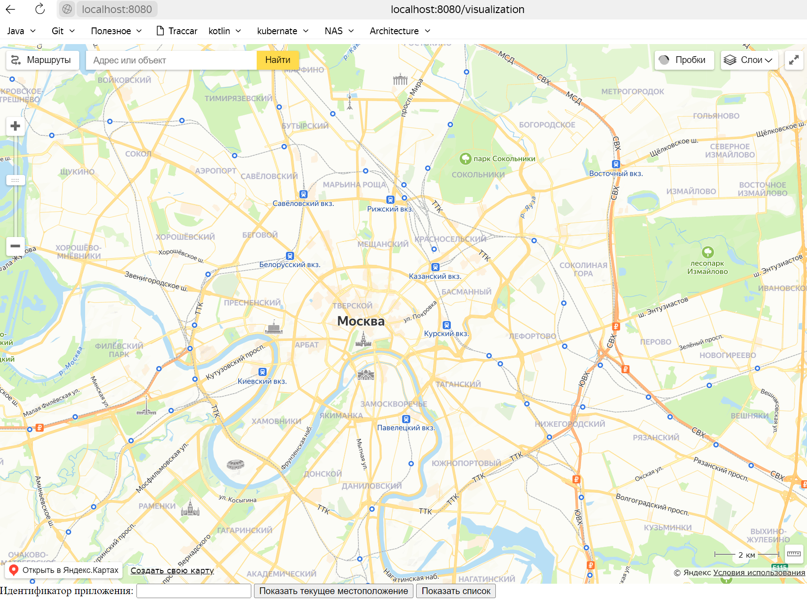
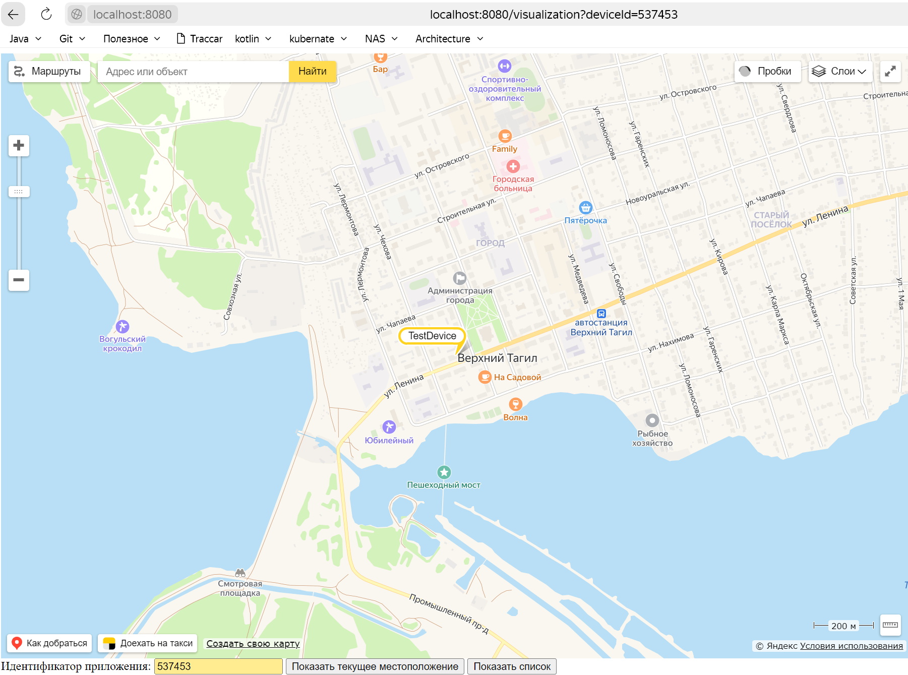

Сирвисы треккинга в микросервисной архитектуре

В данной работе планирую реализовать подход CQRS и Event Sourcing


Состав сервисов:
eventService - принимает запрос по http и регистрирует событие в kafka<br>
consumerService - читает сообщение из очереди и регистрирует в бд MondoDB<br>
visualizationService - читает данные из хранилища и отражает на карте<br>
Для данного проекта используется функционал яндекс карт<br>
Скрин работы приложения




Для визуализации применен движок spring boot с thymeleaf<br>
Для отрисовки карт используются скрипты js<br>
Примеры https://tech.yandex.ru/maps/doc/jsapi/2.1/ref/reference/Placemark-docpage/<br>
Для получения и отрисовки координат на форте используются ajax вызовы mvc контроллера сервиса
Сервис не получилось добавить в контейнер из-за большого количества frontend запросов с переадресацией
В последующем данный момент постараюсь исправить
Адрес фронтовой части http://localhost:8080/visualization

# Сборка проекта
```shell
mvn clean install -DskipTests
```

## Сборка образа
```shell
docker build -t consumerservice:1.0.0 -f ./consumerService/Dockerfile .
```

```shell
docker build -t eventservice:1.0.0 -f ./eventService/Dockerfile .
```

```shell
docker build -t visualizationservice:1.0.0 -f ./visualizationService/Dockerfile .
```

## Установка тега
```shell
docker tag consumerservice:1.0.0 alyanovao/consumerservice:1.0.0
```

```shell
docker tag eventservice:1.0.0 alyanovao/eventservice:1.0.0
```

```shell
docker tag visualizationservice:1.0.0 alyanovao/visualizationservice:1.0.0
```

## Деплой образа в dockerhub
```shell
docker push alyanovao/consumerservice:1.0.0
```

```shell
docker push alyanovao/eventservice:1.0.0
```

```shell
docker push alyanovao/visualizationservice:1.0.0
```

Запуск kafka - не нужно, вынес в manifest
```shell
docker-compose -p broker -f docker/docker-compose.yml up -d
```

Запуск Mongo - установлен Mongo server на локальной машине
https://www.mongodb.com/docs/manual/tutorial/install-mongodb-on-windows/

## Alias
```shell
New-Alias -Name "k" kubectl
```
 
```shell
minikube addons enable ingress
```

```shell
minikube tunnel
```

```shell
k apply -f ./manifest
```

```shell
k delete -f ./manifest
```
